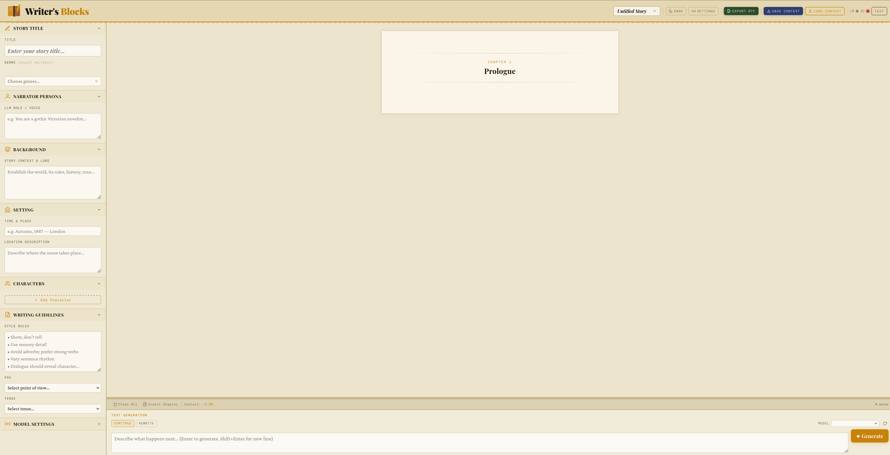

# ✦ Writer's Blocks

**A lightweight, single-file creative writing front-end for [LM Studio](https://lmstudio.ai).**

Writer's Blocks gives you a beautiful, distraction-free workspace for AI-assisted storytelling. Set your narrator's voice, build your world, define your characters, establish writing guidelines — then generate, refine, and export your story, all from one self-contained HTML file. No server, no dependencies to install, no sign-up required.

---

## Screenshot

## Screenshots

**Main UI — Writer's features to help with detail and context.**



---

## Features

### Story Setup
- **Narrator Persona** — Define the LLM's role, voice, and authorial style
- **Background** — Establish world-building lore, rules, and context
- **Setting** — Specify the time, place, and atmosphere of the current scene
- **Characters** — Add as many characters as needed, each with a name and description card
- **Writing Guidelines** — Set style rules, point of view, and narrative tense

### Generation
- **Streaming output** — Text streams live as the model writes, with an animated cursor
- **Five writing modes** — Continue · Rewrite · Brainstorm · Dialogue · Outline
- **Stop generation** — Interrupt mid-stream at any time; partial output is saved automatically
- **Model settings** — Tune Temperature, Max Tokens, Top-P, and Repetition Penalty

### Story Management
- **Section-based editing** — Each generation is saved as its own independent section
- **Delete any section** — Hover a section to reveal a delete button; remove just that response without clearing anything else
- **Clear all** — Wipe the canvas and start fresh
- **Word count** — Live running total at the bottom of the output area

### Export
- **Export DOCX** — One-click Word document export (Garamond, 12pt, double-spaced, US Letter) — generated entirely in the browser, no server needed
- **Download TXT** — Plain-text export of the full story
- **Copy to clipboard** — Copy the entire story in one click

### LM Studio Integration
- **Test connection** — Dedicated button to ping your LM Studio server and verify connectivity
- **Auto-connect** — Automatically attempts to fetch available models on page load
- **Model selector** — Dropdown populated from your running LM Studio instance
- **Configurable server URL** — Defaults to `http://localhost:1234`; change it to match your setup

---

## Getting Started

### Prerequisites
- [LM Studio](https://lmstudio.ai) installed and running with a model loaded
- The LM Studio local server enabled (default port: `1234`)
- A modern web browser (Chrome, Firefox, Edge, Safari)

### Usage

1. **Download** `writers-blocks.html` from this repository
2. **Open** the file in your web browser (double-click, or `File → Open`)
3. **Start LM Studio**, load a model, and enable the local server
4. In Writer's Blocks, click **Test** to verify the connection — the model dropdown will populate automatically
5. Fill in your story setup in the sidebar panels
6. Type a direction in the prompt box and press **Enter** (or click **✦ Generate**)

That's it. No npm install. No Python environment. No API keys.

---

## Interface Overview

```
┌─────────────────────────────────────────────────────────────┐
│  ✦ Writer's Blocks          [Export DOCX] [Server] [Test] ● │
├──────────────────┬──────────────────────────────────────────┤
│                  │                                          │
│  Narrator Persona│   Story output streams here…            │
│  Background      │                                          │
│  Setting         │   Each generation is a deletable        │
│  Characters      │   section with its own divider.         │
│  Writing Guide   │                                          │
│  Model Settings  ├──────────────────────────────────────────┤
│                  │  [Copy] [TXT] [Clear All]    0 words     │
│                  ├──────────────────────────────────────────┤
│                  │  [Continue][Rewrite][Brainstorm]…        │
│                  │  ┌─────────────────────┐ [✦ Generate]   │
│                  │  │ Prompt input…       │ [■ Stop    ]   │
│                  │  └─────────────────────┘                │
└──────────────────┴──────────────────────────────────────────┘
```

---

## Writing Modes

| Mode | What it does |
|---|---|
| **Continue** | Appends a new section, passing the full story context to the model |
| **Rewrite** | Asks the model to rework a passage based on your direction |
| **Brainstorm** | Generates ideas — plot twists, character arcs, world details |
| **Dialogue** | Writes a focused dialogue scene between characters |
| **Outline** | Produces a structured scene or chapter outline |

---

## Tips

- **Persona is powerful.** A well-crafted narrator persona ("gothic Victorian novelist," "terse Hemingway-style realist") has more impact on output quality than any other setting.
- **Stop and keep.** If the model goes in the wrong direction mid-stream, hit **Stop** — the text generated so far is saved as a section. Delete just that section and try a different prompt.
- **Build context gradually.** Use *Continue* mode to grow the story section by section. The model receives the last ~2500 characters of story context with each generation.
- **DOCX for editing.** Export to DOCX when you're ready to do a proper editorial pass in Word or Google Docs.
- **Temperature ~0.85** tends to produce fluent, creative prose. Go higher (1.1–1.3) for more surprising choices; lower (0.5–0.7) for tighter, more predictable output.

---

## Technical Notes

- **Single HTML file** — everything runs in the browser; no build step, no framework
- **DOCX export** uses [docx.js](https://docxjs.org/) loaded from CDN — requires an internet connection the first time the page is opened
- **Generation** uses the OpenAI-compatible `/v1/chat/completions` streaming endpoint exposed by LM Studio
- **Stop** uses the browser's `AbortController` API to cancel the fetch mid-stream
- Tested with LM Studio `0.3.x` and later

---

## Contributing

Issues and pull requests are welcome. This is an intentionally minimal project — feature suggestions that can be implemented without adding dependencies or a build step are most likely to be considered.

---

## License

MIT — do whatever you like with it.
