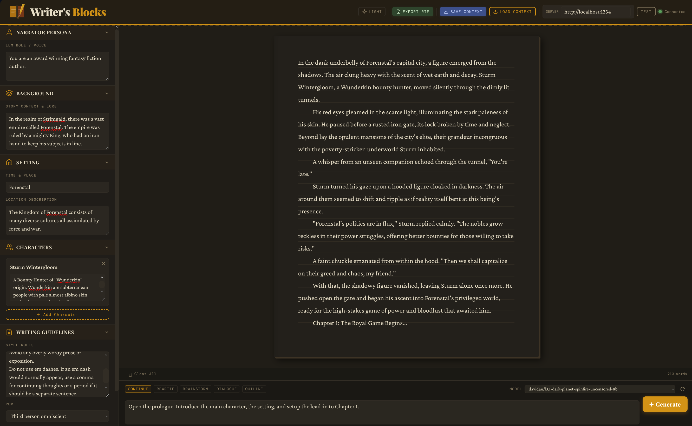

# ✦ Writer's Blocks

**A single-file, zero-dependency creative writing front-end for [LM Studio](https://lmstudio.ai).**

Writer's Blocks is a distraction-free workspace for AI-assisted long-form storytelling. Configure your story's world, characters, and narrative voice — then write with your local model. Everything runs in your browser with no installation, no API keys, and no internet connection required after the page loads.

---
## Screenshots

**Writing UI tailored toward storytellers**



---

## Features at a Glance

- **Multi-story library** — create, switch between, rename, duplicate, and delete stories from a header dropdown; each story saves independently
- **localStorage autosave** — everything persists automatically; no Save button needed
- **Chapter markers & Table of Contents** — insert chapter headings anywhere in your story; a live TOC panel lets you navigate by clicking
- **Streaming AI generation** — text streams live from LM Studio as the model writes
- **Section-based editing** — every AI response is an independent section you can copy, edit, delete, or promote to a chapter heading
- **Story context depth slider** — control exactly how much story text is sent to the model on each generation
- **Genre multi-select** — 34 genre options including top Genres from Amazon, stored as tags
- **SD-Forge-Neo integration** — connect your Stable Diffusion server in Settings
- **RTF export** — manuscript-ready output with chapter headings, double spacing, and section breaks
- **Dark / Light theme** — persists across sessions

---

## What's New in v18 — Chapters & Table of Contents

### Chapter Markers

A **Insert Chapter** button in the toolbar appends a chapter heading at the current end of your story. A dialog prompts for the title — leave it blank for an untitled chapter, or type a name like "The Burning Library".

Chapter markers render inside the story page box as:

```
────────────────────────────────────
         CHAPTER 3
   The Burning Library
────────────────────────────────────
```

Styled with Playfair Display, centered, with decorative rules above and below. Hover a chapter marker to reveal **Edit Title** and **Delete** actions. Edit Title opens an inline input field directly in the story — press Enter to commit or Escape to cancel.

**Promoting an existing section:** Every prose section's hover action bar now includes a **Chapter** button alongside Copy / TXT / Edit / Delete. Clicking it converts that section into a chapter marker (prompts for a title, clears the prose since chapter markers are heading-only). Clicking it again demotes it back to a plain prose section.

Chapter numbers are computed automatically from position in the story — deleting Chapter 2 renumbers Chapter 3 to Chapter 2 everywhere, including the TOC. Numbers are never stored; they're always derived fresh on render.

### Table of Contents Panel

A collapsible TOC panel slides in from the left of the story canvas. It lists every chapter in order with auto-computed numbers and a per-chapter word count.

- **Click any entry** to smooth-scroll directly to that chapter in the story
- **Active chapter highlighting** — an `IntersectionObserver` watches the viewport as you scroll and highlights the current chapter's TOC entry in amber
- **Auto-opens** when you insert your first chapter marker
- **Collapsed state** — a small vertical "TOC" tab on the left edge of the story area reopens it without taking up canvas space
- **Empty state** — shows a gentle prompt to insert a chapter when no chapters exist yet

### Chapter Headings in RTF Export

The RTF exporter now handles chapter markers as proper document headings:

- Chapter number on its own centered line
- Chapter title as a bold centered heading (28pt)
- Double spacing before each chapter
- First paragraph after a chapter heading has no text indent (matching standard manuscript convention)
- The `* * *` section break between prose sections is suppressed immediately after a chapter heading — no double separator

---

## Getting Started

### Prerequisites
- [LM Studio](https://lmstudio.ai) installed, running, with a model loaded and the local server enabled (default port `1234`)
- A modern web browser (Chrome, Edge, Safari, Firefox)

### Usage

1. **Download** `writers-blocks.html` from this repository
2. **Open** it in your browser — double-click, or `File → Open`
3. **Start LM Studio**, load a model, enable the local server
4. In Writer's Blocks, click **Test** to verify the connection
5. Fill in the sidebar: title, genre, persona, background, setting, characters
6. Type a direction in the prompt box and press **Enter** (or **✦ Generate**)
7. Use **Insert Chapter** in the toolbar to add chapter headings as your story grows

Your work saves automatically. Come back tomorrow and it will be exactly where you left it.

---

## Interface Overview

```
┌──────────────────────────────────────────────────────────────────────────────┐
│  ✦ Writer's Blocks  [▾ The Atlas of Lost Cities ●]  [🌙]  [⚙ Settings]     │
│  [Export RTF] [Save Context] [Load Context]           LM ●  SD ●  [Test]   │
├──────────────────┬───────────────┬────────────────────────────────────────── │
│                  │  ┌─ Contents ─┤  ┌────────────────────────────────────┐  │
│  ▾ Story Title   │  │ 1. Arrival │  │  The Atlas of Lost Cities          │  │
│  ▾ Narrator      │  │   842 wds  │  │  ────────────────────              │  │
│  ▾ Background    │  │ 2. Storm ◀ │  │                                    │  │
│  ▾ Setting       │  │   1,204 wds│  │  ─────── CHAPTER 1 ────────       │  │
│  ▾ Characters    │  │ 3. Library │  │     The Arrival                    │  │
│  ▾ Guidelines    │  │   630 wds  │  │  ─────────────────────────        │  │
│  ▸ Model Settings│  └────────────┤  │                                    │  │
│                  │               │  │  Prose text flows here, inside     │  │
│                  │               │  │  the lightly-bordered page box…    │  │
│                  │               │  └────────────────────────────────────┘  │
│                  ├──────────────────────────── ▲ drag ──────────────────────┤
│                  │  [Clear All] [Insert Chapter]  Context: ~5K   2,676 words │
│                  ├──────────────────────────────────────────────────────────┤
│                  │  Text Generation                                          │
│                  │  [Continue] [Rewrite]               MODEL ▾  [↺]        │
│                  │  ┌────────────────────────────┐  [✦ Generate]           │
│                  │  │ Prompt…                    │  [■ Stop    ]           │
│                  │  └────────────────────────────┘                          │
└──────────────────┴──────────────────────────────────────────────────────────┘
```

---

## Story Setup (Sidebar)

| Panel | What it controls |
|---|---|
| **Story Title** | Title displayed at top of story canvas; used in all exported filenames |
| **Genre** | Multi-select with 34 options across Fiction, Speculative, and Other groups; selected as amber tag chips; included in every generation prompt |
| **Narrator Persona** | The LLM's authorial voice and role; the most impactful single field for output quality |
| **Background** | World-building lore, history, rules, and tone |
| **Setting** | Time period and location, plus a longer scene description |
| **Characters** | Name + description cards; as many as needed; included in the system prompt |
| **Writing Guidelines** | Style rules, point of view, and narrative tense |
| **Model Settings** | Temperature, Max Tokens, Top-P, Repetition Penalty, and Story Context Depth — all per-story |

All panels are collapsible. Model Settings is collapsed by default.

---

## Multi-Story Library

A story switcher dropdown in the header manages your full library of projects.

```
┌──────────────────────────────────┐
│  My Stories               [+ New]│
│ ─────────────────────────────── │
│ ▶ The Atlas of Lost Cities  ✎⧉🗑 │  ← active (amber)
│   12,847 words · just now        │
│ ─────────────────────────────── │
│   The Cartographer's War    ✎⧉🗑 │
│   3,204 words · 2h ago           │
│ ─────────────────────────────── │
│   Untitled Story            ✎⧉🗑 │
│   0 words · yesterday            │
│ ─────────────────────────────── │
│  Storage: 48 KB / ~5 MB  ▓░░░░  │
└──────────────────────────────────┘
```

| Action | How |
|---|---|
| **Switch** | Click the story name; saves current story first |
| **New Story** | `+ New` button at the top of the dropdown |
| **Rename** | ✎ icon — edits the title inline, commits on Enter |
| **Duplicate** | ⧉ icon — copies context and sidebar into a new story with a blank canvas |
| **Delete** | 🗑 icon — confirmation dialog required; last story cannot be deleted |

**Global preferences** (theme, LM Studio URL, SD-Forge URL) are stored separately from stories — they persist across story switches.

---

## localStorage Autosave

Your work saves automatically as you write. There is no Save button.

- **Debounced 800ms autosave** — fires 800ms after any change
- **Immediate save on tab close** — `beforeunload` listener flushes pending changes
- **Immediate save on tab switch** — `visibilitychange` listener catches background tab scenarios
- **Dirty indicator** — a small amber dot on the story switcher button shows unsaved changes; clears when the save fires
- **Storage usage bar** in the dropdown footer shows current usage against the ~5 MB browser limit
- **"Clear All Saved Data"** in Settings wipes everything with a confirmation guard

---

## Story Context Depth

The slider in Model Settings controls how much of your existing story text is sent to the model with each generation request. It is saved per story.

| Slider | Sent to model | Best for |
|---|---|---|
| Last section only | Most recent section only | Very tight context windows |
| ~1K chars | ~250 words | Short context models |
| ~2.5K chars | ~625 words | **Default** — matches original behavior |
| ~5K chars | ~1,250 words | Medium-length stories |
| ~10K chars | ~2,500 words | Long stories, good context windows |
| ~20K chars | ~5,000 words | Very long stories |
| Full story | Everything | Short stories or large context windows |

The current setting appears as a live badge in the toolbar ("Context: ~5K").

---

## Section Actions

Each AI-generated response is saved as an independent section. Hover any section to reveal its action bar.

| Action | What it does |
|---|---|
| **Copy** | Copies section text to clipboard |
| **TXT** | Downloads the section as a timestamped `.txt` file |
| **Edit** | Replaces section with an editable textarea; Ctrl/Cmd+S to save, Escape to cancel |
| **Chapter** | Promotes the section to a chapter marker (prompts for title; clears prose) |
| **Delete** | Removes that section; other sections are unaffected |

---

## Export & Import

| Button | Format | Contents |
|---|---|---|
| **Export RTF** | `.rtf` | Full story with title heading, chapter headings, double-spaced prose, `* * *` section breaks. Opens in Word, LibreOffice, Pages, WordPad. |
| **Save Context** | `.json` | All sidebar fields (no sections). Timestamped filename. |
| **Load Context** | — | Imports a context JSON as a **new story** — never overwrites current work. |
| **TXT** *(per section)* | `.txt` | Single section as plain text. |

---

## Settings Modal

### LM Studio
- Server URL (default `http://localhost:1234`)
- Test Connection — shows live status and currently loaded model name
- Status light in header (green = connected)

### SD-Forge-Neo / Automatic1111
- Server URL (default `http://localhost:7860`)
- Test Connection — reads `sd_model_checkpoint` from the options endpoint
- Status light in header (green = connected)

### Storage
- "Clear All Saved Data" — wipes all `wb-*` localStorage keys with a confirmation guard

---

## RTF Export Details

The exported `.rtf` opens in Microsoft Word, LibreOffice Writer, Apple Pages, and Windows WordPad without any conversion.

**Formatting:**
- Times New Roman, 12pt body text
- Double-spaced lines
- First-line indents on body paragraphs (except after chapter headings and at the start of the story)
- Story title: 36pt centered bold heading
- Chapter number: 20pt centered label
- Chapter title: 28pt centered bold heading
- Double spacing before each chapter
- `* * *` centered ornamental breaks between prose sections (suppressed after chapter headings)

---

## Storage Details

Data lives in **browser localStorage**, keyed to the file path you open the HTML from.

```
localStorage keys:
├── wb-global          → theme, lmUrl, sdUrl
├── wb-stories         → registry: [{id, title, lastModified, wordCount}]
├── wb-active          → UUID of last opened story
└── wb-story-{uuid}    → full appState per story (sections, sidebar, chars, etc.)
```

**Physical location (read-only reference):**

- Chrome: `C:\Users\Name\AppData\Local\Google\Chrome\User Data\Default\Local Storage\leveldb\`
- Edge: `C:\Users\Name\AppData\Local\Microsoft\Edge\User Data\Default\Local Storage\leveldb\`

These are binary LevelDB databases — not directly editable.

| Scenario | Behaviour |
|---|---|
| Browser restart / reboot | ✓ Data survives |
| Move the HTML file to a new folder | ⚠ New origin — old data still exists under the old path |
| Clear browsing data in browser | ✗ localStorage is wiped |
| Different browser | ✗ Each browser has isolated storage |
| Incognito / Private mode | ✗ Wiped when window closes |

**Recommendation:** Use **Save Context** (JSON export) and **Export RTF** as your real backups. For path-independent storage, serve the file from a local web server:

```bash
python -m http.server 8000
# then open http://localhost:8000/writers-blocks.html
```

---

## Context File Format

```json
{
  "_version": "2.0",
  "_app": "Writer's Blocks",
  "_exported": "2025-10-14T18:32:00.000Z",
  "title": "The Atlas of Lost Cities",
  "genres": ["Gothic", "Magical Realism"],
  "persona": "You are a lyrical literary fiction writer…",
  "background": "In this world, cartography is a sacred profession…",
  "settingTime": "Turn of the 20th century, Central Europe",
  "settingPlace": "A cramped cartographer's studio above a cobbled square…",
  "characters": [
    { "name": "Mira Voss", "description": "A journeyman cartographer…" },
    { "name": "Director Hal", "description": "Head of the Imperial Survey…" }
  ],
  "guidelines": "• Show, don't tell\n• Ground magic in sensory detail…",
  "pov": "Third person limited",
  "tense": "Past tense",
  "lmUrl": "http://localhost:1234",
  "sdUrl": "http://localhost:7860",
  "contextDepthIdx": 3
}
```

Importing always creates a new story. The v1.0 single-string genre format is still accepted on import.

---

## Writing Tips

- **Persona is the most powerful setting.** "Terse Hemingway-style realist" or "gothic Victorian novelist" produce measurably different prose. Be specific about voice, not just genre.
- **Chapter markers early.** Insert chapter headings before you write each chapter, not after. It's easier to orient yourself in the TOC when the structure exists first.
- **Use the context depth slider actively.** For short stories, Full Story keeps the model oriented. For long novels, 5K–10K chars is usually the sweet spot — enough context for coherence without burning the entire context window.
- **Duplicate before experimenting.** Before trying a risky narrative direction, duplicate the story. Explore in the copy. Keep what works.
- **Stop and keep.** If the model veers off mid-stream, hit Stop — partial text is saved as a section. Delete just that section and try a different prompt direction.
- **Export context early.** Once your sidebar is set up well, export a context JSON and store it in a safe folder. This gives you a portable backup that opens on any machine with any copy of Writer's Blocks.
- **Temperature ~0.85** produces fluent, creative prose. Go higher (1.1–1.3) for more surprising word choices; lower (0.5–0.7) for tighter, more predictable output.
- **Chapter word counts in the TOC** give you a quick structural overview of your story's pacing — chapters with very different word counts often signal pacing problems worth revisiting.

---

## Technical Notes

- **Single HTML file** — no build step, no framework, no CDN, no dependencies
- **1,952 lines** of HTML/CSS/JS; 99 functions
- **appState architecture** — one object per story is the source of truth; DOM renders from it, functions read from it, localStorage persists it
- **Chapter numbering** — always computed dynamically from section order, never stored; renumbers automatically on deletion
- **IntersectionObserver** — tracks which chapter heading is in the viewport and highlights the TOC entry; re-initializes after every `renderSections()` call
- **RTF generation** — written from scratch in-browser using RTF 1.x syntax; no library needed
- **Streaming** — OpenAI-compatible `/v1/chat/completions` streaming endpoint (LM Studio)
- **Stop** — browser `AbortController` API; partial output is preserved as a section
- **SD-Forge-Neo** — A1111-compatible `/sdapi/v1/options` and `/sdapi/v1/txt2img` endpoints
- Tested with LM Studio `0.3.x` and later

---

## Version History

| Version | Key changes |
|---|---|
| **v18** | Chapter markers, Table of Contents panel with IntersectionObserver, chapter headings in RTF export, Chapter action on prose sections |
| **v17** | Multi-story library, localStorage autosave, story switcher dropdown, storage indicator, per-story context depth, import creates new story |
| **v16** | appState single source of truth, context depth slider (7 presets), genre array in state, pure system prompt builder |
| **v14** | Timestamps on all exports, genre in context export/import |
| **v13** | Resizable prompt panel, genre multi-select (34 options from Amazon), genre in system prompt |
| **v11** | SD-Forge-Neo integration in Settings, dual status lights (LM + SD), Settings modal |
| **v8** | Scrolling story canvas, removed book pagination |
| **v7** | Edit/Save per section with inline textarea, Ctrl+S shortcut |

---

## Contributing

Issues and pull requests are welcome. The single-file, no-build-step constraint is intentional — features that require a bundler or external dependencies won't be accepted, but everything else is fair game.

---

## License

MIT — do whatever you like with it.
